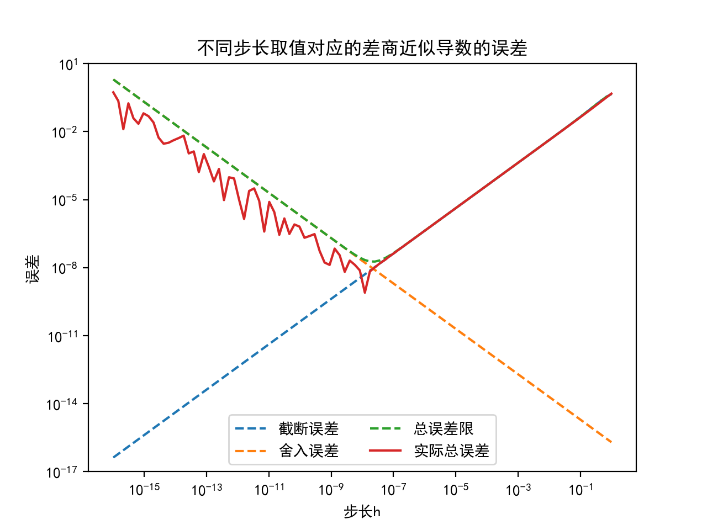
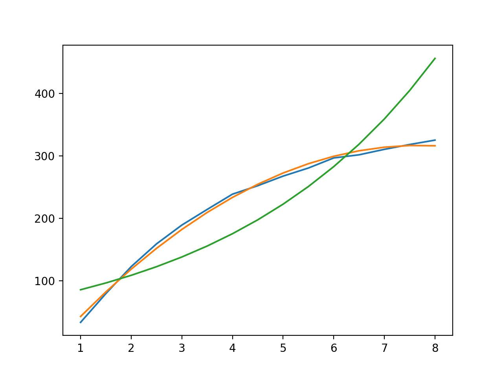
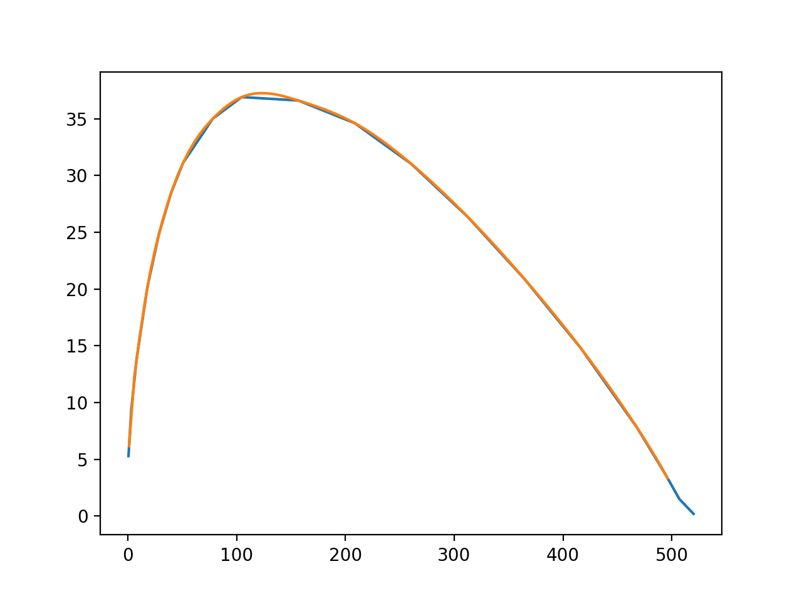

# 数值分析上机实验

2016011370 蔡振廷

## Chapter 1

### 1-1



原图：`Chapter1/1-1.png`

#### 实验代码

`Chapter1/1-1.py`

### 1-3

#### (1) 采用 IEEE 单精度浮点数，观察当 n 为何值时求和结果不再变化，并与理论分析进行比较

在编写代码进行实验后，发现当 $n=2097152$ 时结果不再变化，此时的求和结果为15.4036827。

由定理 1.6 可以知道，在进行运算时，如果当前 n 的倒数与当前求和值之比小于一半的机器精度，则求和结果不再变化。

在这个例子当中，理论上当 $n\geq 2^{24}  / 15.5 \approx 2^{20}$ 时，结果就应该不再变化，但是在实际系统中，编译器会进行舍入，因此直到 $n = 2^{21} = 2097152$ 时结果才会无变化。

#### (2) 采用 IEEE 双精度浮点数计算 (1) 中前 n 项的和，评估 IEEE 单精度浮点数计算结果的误差

使用双精度浮点数计算 $n=2097152$ 时的求和结果为 15.13330669，绝对误差为 0.27037601，相对误差为 0.01786629

#### (3) 采用 IEEE 双精度浮点数，估计当 n 为何值时求和结果不再变化，需要多长时间

类似于前面的分析，我们知道双精度浮点数能表示 53 位尾数，而求和结果的整数部分应该为 33。因此可以记录 47 位的小数值，则当 n 为 $2^{48} = 281474976710656$ 时求和结果不再变化。

前面单精度运算所需时间为 15ms，以此可以估计双精度运算所需时间为 $15 \times 2^{48} / 2^{21} \approx 23  $ 天。

#### 实验代码

`Chapter1/1-3.cpp`

## Chapter2

### 2-2

对于牛顿迭代法而言，两个方程的初始 x 分别设为 0.6 和 1.35。

$\lambda_0$ 取值为 1.0，$\epsilon$ 取值为 $10^{-10}$

两个方程分别利用阻尼牛顿迭代法、牛顿迭代法和 fzero法求解的结果如下：

```bash
>>> USING DAMPED NEWTON METHOD
Solving 1.0*x**3 - 1.0*x - 1.0 ...
iteration:   1, lambda: 0.016, x: 1.1406250
iteration:   2, lambda: 0.500, x: 1.3668137
iteration:   3, lambda: 0.500, x: 1.3262798
iteration:   4, lambda: 0.500, x: 1.3247202
iteration:   5, lambda: 0.500, x: 1.3247180
approx solution for 1.0*x**3 - 1.0*x - 1.0 is 1.3247180

Solving -1.0*x**3 + 5.0*x ...
iteration:   1, lambda: 0.062, x: 2.4969586
iteration:   2, lambda: 0.500, x: 2.2719762
iteration:   3, lambda: 0.500, x: 2.2369017
iteration:   4, lambda: 0.500, x: 2.2360684
iteration:   5, lambda: 0.500, x: 2.2360680
approx solution for -1.0*x**3 + 5.0*x is 2.2360680

>>> USING NORMAL NEWTON METHOD
Solving 1.0*x**3 - 1.0*x - 1.0 ...
iteration:   1, lambda: 1.000, x: 17.9000000
iteration:   2, lambda: 1.000, x: 11.9468023
iteration:   3, lambda: 1.000, x: 7.9855204
iteration:   4, lambda: 1.000, x: 5.3569093
iteration:   5, lambda: 1.000, x: 3.6249960
iteration:   6, lambda: 1.000, x: 2.5055892
iteration:   7, lambda: 1.000, x: 1.8201294
iteration:   8, lambda: 1.000, x: 1.4610441
iteration:   9, lambda: 1.000, x: 1.3393232
iteration:  10, lambda: 1.000, x: 1.3249129
iteration:  11, lambda: 1.000, x: 1.3247180
iteration:  12, lambda: 1.000, x: 1.3247180
approx solution for 1.0*x**3 - 1.0*x - 1.0 is 1.3247180

Solving -1.0*x**3 + 5.0*x ...
iteration:   1, lambda: 1.000, x: 10.5256684
iteration:   2, lambda: 1.000, x: 7.1242866
iteration:   3, lambda: 1.000, x: 4.9107807
iteration:   4, lambda: 1.000, x: 3.5169113
iteration:   5, lambda: 1.000, x: 2.7097430
iteration:   6, lambda: 1.000, x: 2.3369400
iteration:   7, lambda: 1.000, x: 2.2422443
iteration:   8, lambda: 1.000, x: 2.2360934
iteration:   9, lambda: 1.000, x: 2.2360680
iteration:  10, lambda: 1.000, x: 2.2360680
approx solution for -1.0*x**3 + 5.0*x is 2.2360680

>>> USING FZERO METHOD
[1.32471796]
[2.23606798]
```

阻尼牛顿法的关键在于利用阻尼因子使得近似解更接近与准确解，尤其是在初始解离准确解较远的时候效果更为明显，这也使得阻尼牛顿法收敛所需次数更少。

如果以 fero 进行验证，可以看出牛顿法的相对误差为 $3.0195107 \times 10^{-8}$ 、$8.944272\times 10^{-8}$

#### 实验代码

`Chapter2/Damped_Newton_Method.py`

## Chapter 3

### 3-6

#### (1) 设 $n=10$，计算 $||r||_\infin$、$||\Delta x||_\infin$

计算得到残差的无穷范数为 0.2211168， 误差的无穷范数为 0.0002443

#### (2) 在右端项施加 $10^{-7}$ 的扰动然后解方程组，观察残差和误差的变化情况

残差的无穷范数为 1.0309976，误差的无穷范数为 30.5118420

可以发现就算是极小的扰动也会使得误差变化很大，这是由于 Hilbert 矩阵是一个条件数很大的病态矩阵

#### (3)改变 n 的值为 8 和 12，求解相应的方程，观察残差和误差的变化情形

当 $n = 8$ 时，残差的无穷范数为 0.1969826，误差的无穷范数为0.0000001

当 $n = 12$ 时，残差的无穷范数为 0.2402916，误差的无穷范数为0.4064345

观察三种情况的变化情形，可以发现当 n 越大时，方程组解的误差越大。这个结论同样的与 Hilbert 矩阵的病态性有关。

#### 实验代码

`Chapter3/Hilbert_Cholesky.py`

## Chapter 4

### 4-2

#### (1) 对 $\epsilon = 1, a = 1 / 2, n = 100$，分别用雅克比、G-S 和 SOR 方法求线性方程组的解，要求有 4 位有效数字，然后比较与精确解的误差

雅克比

```
[0.         0.01284681 0.02561592 0.03830815 0.05092421 0.06346492
 0.07593098 0.0883232  0.10064223 0.11288892 0.12506385 0.13716789
 0.14920158 0.16116581 0.17306108 0.18488828 0.19664788 0.20834077
 0.21996739 0.23152865 0.24302493 0.25445716 0.26582569 0.27713146
 0.28837478 0.2995566  0.31067719 0.32173751 0.33273782 0.34367905
 0.35456144 0.36538595 0.37615277 0.38686286 0.39751639 0.40811433
 0.41865683 0.42914483 0.43957848 0.44995872 0.46028567 0.47056027
 0.48078264 0.4909537  0.50107354 0.51114309 0.52116242 0.53113246
 0.54105328 0.55092577 0.56075001 0.57052687 0.58025642 0.58993953
 0.59957626 0.60916747 0.6187132  0.6282143  0.63767082 0.64708359
 0.65645264 0.6657788  0.67506211 0.68430335 0.69350259 0.70266058
 0.7117774  0.72085377 0.72988976 0.73888611 0.74784287 0.75676074
 0.76563981 0.77448075 0.78328365 0.79204915 0.80077736 0.80946889
 0.81812386 0.82674287 0.83532603 0.84387391 0.85238667 0.86086482
 0.86930852 0.87771829 0.8860943  0.89443702 0.90274664 0.9110236
 0.91926812 0.92748062 0.9356613  0.94381058 0.95192866 0.96001594
 0.96807265 0.97609913 0.98409564 0.99206251]
```

G-S

```
[0.         0.01284865 0.02561959 0.03831362 0.05093149 0.06347396
 0.07594178 0.08833571 0.10065648 0.11290481 0.12508142 0.13718704
 0.14922238 0.16118812 0.17308497 0.18491361 0.19667472 0.20836897
 0.21999704 0.23155957 0.24305723 0.25449065 0.26586048 0.27716734
 0.28841188 0.2995947  0.31071642 0.32177765 0.33277899 0.34372103
 0.35460437 0.36542959 0.37619726 0.38690796 0.39756225 0.40816069
 0.41870384 0.42919224 0.43962645 0.45000699 0.46033439 0.47060919
 0.48083191 0.49100306 0.50112315 0.51119269 0.52121218 0.53118211
 0.54110298 0.55097527 0.56079945 0.57057601 0.58030542 0.58998814
 0.59962463 0.60921534 0.61876074 0.62826127 0.63771737 0.64712947
 0.65649802 0.66582344 0.67510615 0.68434658 0.69354514 0.70270225
 0.71181831 0.72089373 0.7299289  0.73892423 0.7478801  0.7567969
 0.76567502 0.77451483 0.78331672 0.79208104 0.80080819 0.8094985
 0.81815236 0.82677011 0.83535212 0.84389872 0.85241028 0.86088712
 0.8693296  0.87773804 0.88611279 0.89445417 0.9027625  0.91103812
 0.91928135 0.92749249 0.93567187 0.94381979 0.95193657 0.9600225
 0.96807789 0.97610305 0.98409825 0.99206381]
```

SOR

```
[0.         0.01284966 0.0256216  0.03831661 0.05093546 0.06347889
 0.07594767 0.08834252 0.1006642  0.11291343 0.12509093 0.13719742
 0.14923359 0.16120016 0.17309781 0.18492724 0.19668911 0.2083841
 0.22001288 0.23157611 0.24307444 0.2545085  0.26587896 0.27718642
 0.28843153 0.2996149  0.31073714 0.32179886 0.33280067 0.34374316
 0.35462691 0.36545252 0.37622055 0.38693158 0.39758618 0.40818491
 0.41872831 0.42921694 0.43965134 0.45003205 0.4603596  0.47063452
 0.48085733 0.49102855 0.50114868 0.51121823 0.52123771 0.5312076
 0.54112841 0.5510006  0.56082468 0.5706011  0.58033034 0.59001288
 0.59964916 0.60923964 0.61878479 0.62828504 0.63774084 0.64715263
 0.65652084 0.6658459  0.67512824 0.68436828 0.69356643 0.70272311
 0.71183872 0.72091368 0.72994838 0.73894321 0.74789857 0.75681485
 0.76569244 0.77453171 0.78333303 0.79209679 0.80082335 0.80951309
 0.81816635 0.82678349 0.83536489 0.84391087 0.8524218  0.86089801
 0.86933985 0.87774766 0.88612176 0.8944625  0.90277019 0.91104516
 0.91928773 0.92749823 0.93567696 0.94382423 0.95194036 0.96002565
 0.96808041 0.97610492 0.9840995  0.99206443]
```

精确解

```
[0.         0.01287047 0.02566262 0.03837724 0.0510151  0.06357696
 0.07606358 0.0884757  0.10081407 0.11307943 0.12527249 0.13739399
 0.14944462 0.16142509 0.17333611 0.18517837 0.19695254 0.20865931
 0.22029934 0.23187331 0.24338186 0.25482566 0.26620533 0.27752153
 0.28877488 0.299966   0.31109553 0.32216406 0.33317222 0.34412059
 0.35500977 0.36584035 0.37661292 0.38732805 0.39798632 0.40858828
 0.41913451 0.42962554 0.44006194 0.45044425 0.460773   0.47104873
 0.48127197 0.49144324 0.50156305 0.51163191 0.52165034 0.53161884
 0.5415379  0.55140801 0.56122967 0.57100334 0.58072952 0.59040868
 0.60004127 0.60962777 0.61916864 0.62866432 0.63811527 0.64752193
 0.65688474 0.66620414 0.67548057 0.68471444 0.69390619 0.70305622
 0.71216497 0.72123283 0.73026021 0.73924752 0.74819516 0.75710352
 0.76597299 0.77480395 0.7835968  0.79235191 0.80106966 0.80975041
 0.81839454 0.82700241 0.83557438 0.8441108  0.85261204 0.86107845
 0.86951036 0.87790812 0.88627207 0.89460256 0.9028999  0.91116444
 0.91939649 0.92759638 0.93576443 0.94390096 0.95200629 0.96008071
 0.96812454 0.97613809 0.98412165 0.99207552]
```

误差为

```
jacobian error: 0.0004895
gs error: 0.0004402
sor error: 0.0004147
```

#### (2) 对 $\epsilon =0.1, \epsilon = 0.01, \epsilon = 0.0001$ 考虑同样的问题

当 $\epsilon = 0.1$ 时，误差为

```
jacobian error: 0.0088846
gs error: 0.0088717
sor error: 0.0088631
```

当 $\epsilon = 0.01$ 时，误差为

```
jacobian error: 0.0660637
gs error: 0.0660631
sor error: 0.0660627
```

当 $\epsilon = 0.0001$ 时，误差为

```
jacobian error: 0.0049507
gs error: 0.0049505
sor error: 0.0049506
```

#### 实验代码

`Chapter4/Differenntial_Equation.py`

## Chapter5

### 5-1

根据幂法可以得到

(1) 最大特征值为12.2543123837，对应的特征向量为[9.285119165836644, -13.77572281436808, 12.254312383680205]T

(2) 最大特征值为97.0219019943，对应的特征向量为[-58.60467962578929, 97.02190199432974, -24.292250863707892]T

## Chapter 6

### 6-3

#### (1) 用公式 $y=a+bt+ct^2$做曲线拟合

拟合结果：

```
[ 42.77323529  82.21184874 118.58704913 151.89883646 182.14721073
 209.33217195 233.4537201  254.5118552  272.50657725 287.43788623
 299.30578216 308.11026503 313.85133484 316.5289916  316.14323529]
```

误差：22.01377

#### (2) 用指数函数  $y = ae^{bt}$ 做曲线拟合

拟合结果：

```
[ 85.58725256  96.45032147 108.69217358 122.48780944 138.03444138
 155.55431266 175.29787455 197.54736654 222.62085109 250.87676039
 282.71902023 318.60282426 359.04114107 404.61204724 455.96699109]
```

误差：218.90971

#### (3) 比较上述两条拟合曲线，哪条更好？

由误差可以看出多项式的曲线拟合比较好。

将两者拟合的曲线绘制成下图也可以得到相同结论，其中蓝色曲线为真实数值、橘色曲线为多项式拟合、绿色曲线为指数拟合。

#### 实验代码

`Chapter6/physical_experiment.py`

### 6-8

#### 各点的函数值、一阶导数、二阶导数的近似值

当 $x = 2$ 时，

```
f(x): 7.825155342374416
f'(x): 1.5568351436014618
f''(x): -0.22125968048111483
```

当 $x = 30$ 时，

```
f(x): 25.386234761383875
f'(x): 0.3548743912492055
f''(x): -0.00784271011485736
```

当 $x = 130$ 时，

```
f(x): 37.21384058281403
f'(x): -0.010391887760431082
f''(x): -0.0013821190112167437
```

当 $x = 350$ 时，

```
f(x): 22.475111281391065
f'(x): -0.1077842647150654
f''(x): -0.00023026441808904563
```

当 $x = 515$ 时，

```
f(x): 0.5427133606681928
f'(x): -0.089906174183753
f''(x): 0.008119732786636146
```

以 5 为间隔将 1 到 500 的 x 所对应的函数值以及采样点对应的坐标绘制成下图：



其中，蓝色曲线是实际采样点对应的坐标、橘色曲线是三次样条插值得到的结果。可以看出，样条插值的效果很好。